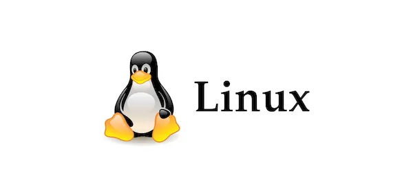

<h1 align="center">
  
   
  Linux
</h1>

# 01-converter-imagens
Conversor de imagens de jpg para png.

# 02-log - Expressão Regular
**01-processo-memoria.sh**
  * Buscar pelo 10 processo ativos que mais consomem memória e salvar com data, hora e consumo de mempória.

**02.01-apache-log.sh**
  * Realiza uma busca por id utilizando regex

**02.02-apache-log.sh**
  * Bucar por GET, POST, PUT ou DELETE.
  * Converte o valor para maiúsculo.
  * Caso não informe o parâmetro, faz a solicitação.# linux
